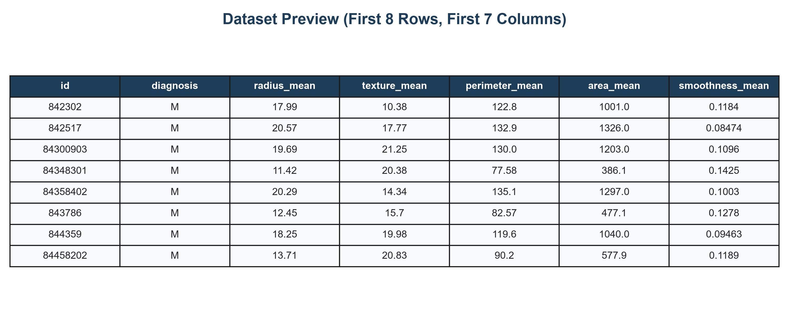
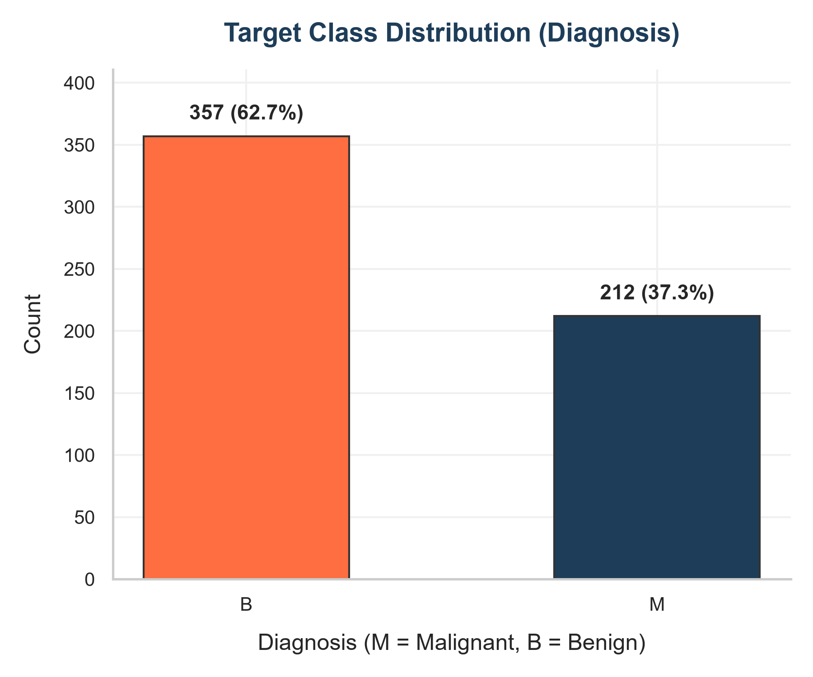
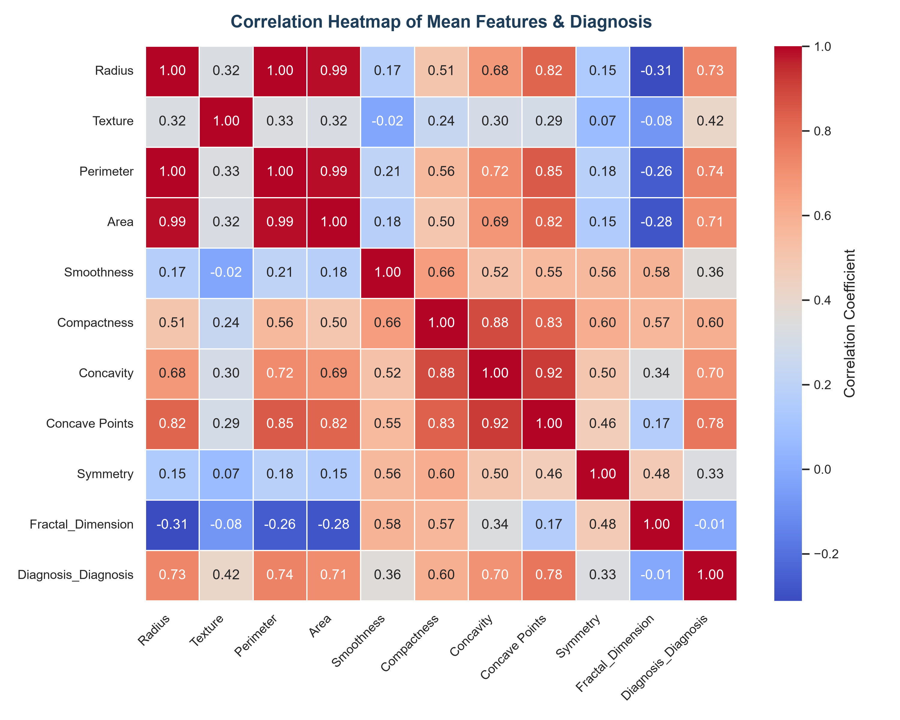
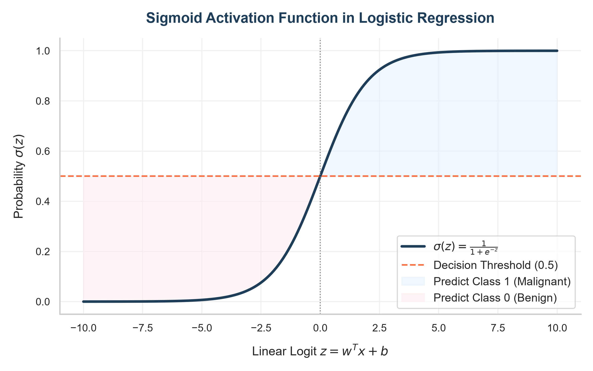
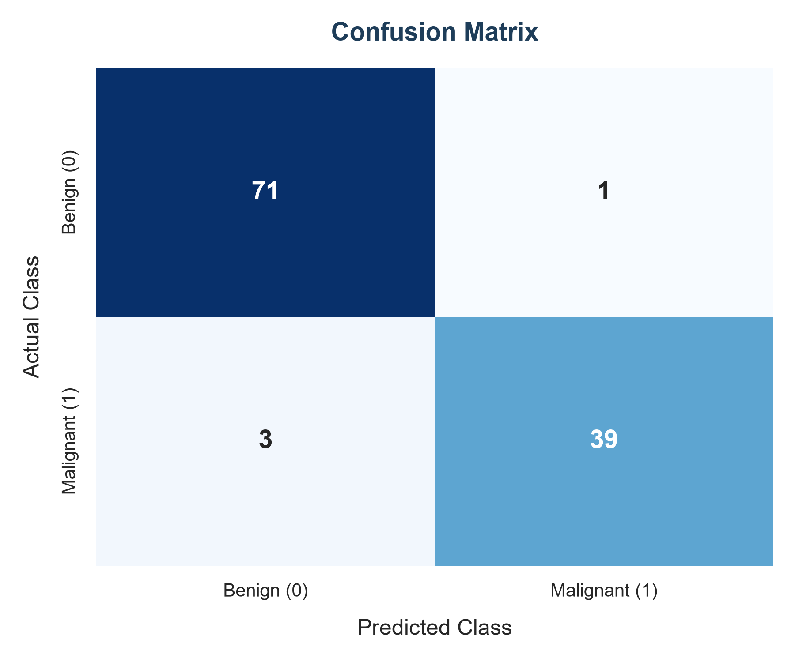
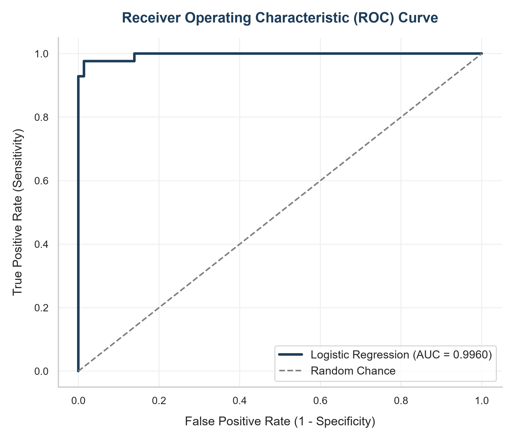
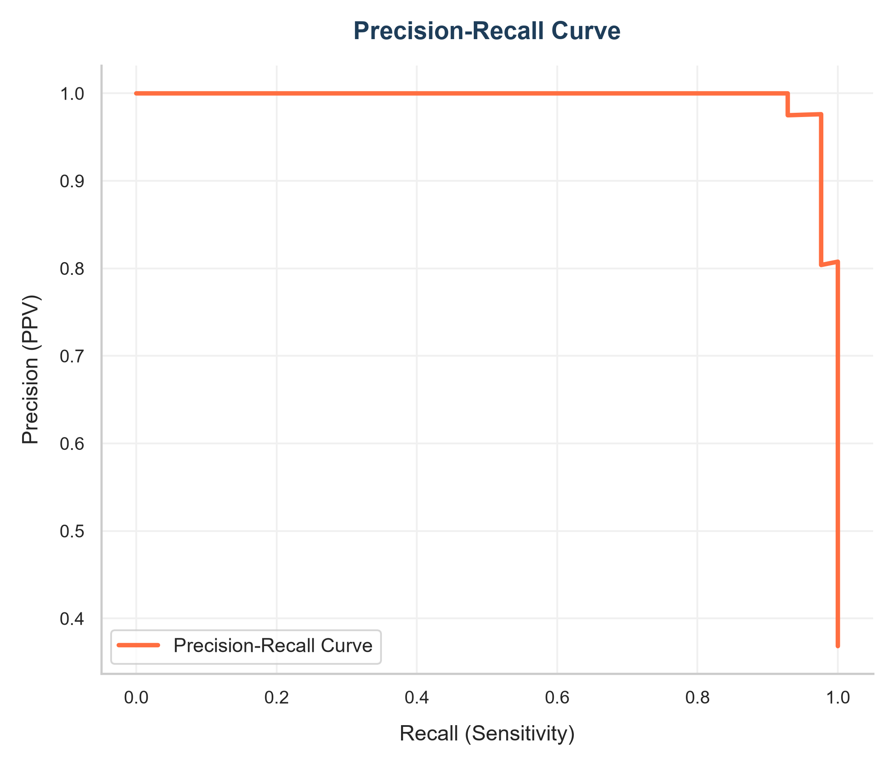
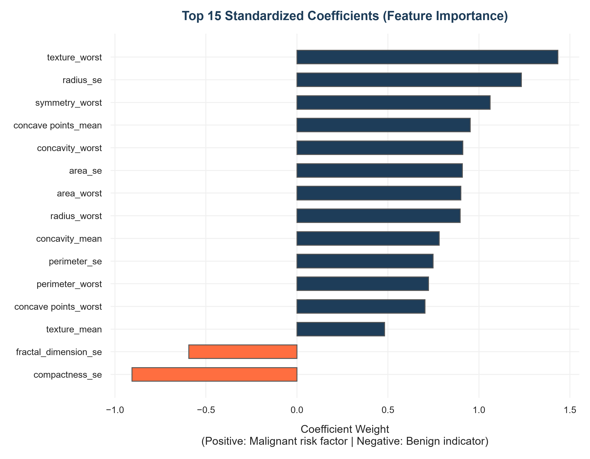

# Breast Cancer Classification using Logistic Regression

An end-to-end Machine Learning pipeline utilizing **Logistic Regression** to classify breast cancer tumors as either **Malignant (M)** or **Benign (B)**. This project uses the Breast Cancer Wisconsin Diagnostic dataset to train a binary classifier, perform detailed evaluation (ROC, Precision-Recall, Confusion Matrix), and serialize the trained pipeline for future inference.

---

## 📋 Table of Contents
1. [Project Overview](#-project-overview)
2. [Repository Structure](#-repository-structure)
3. [Mathematical Primer](#-mathematical-primer)
4. [Installation & Setup](#-installation--setup)
5. [Pipeline Workflow](#-pipeline-workflow)
6. [Model Evaluation & Metrics](#-model-evaluation--metrics)
7. [Visual Gallery](#-visual-gallery)
8. [Feature Interpretation](#-feature-interpretation)
9. [Running Inference](#-running-inference)

---

## 🔍 Project Overview

The clinical task of identifying whether a tumor is malignant or benign is modeled as a binary classification problem. Using the patient diagnostic values, a Logistic Regression model is trained using $L_2$ regularization (Ridge penalty) to compute probabilities of malignancy.

The pipeline automates:
* Data ingestion, cleaning, and preprocessing.
* Multi-faceted Exploratory Data Analysis (EDA).
* Data partition into stratified train and test sets to prevent target distribution skew.
* Standardized scaling of predictors using a robust pipeline to prevent target leakage.
* Performance assessment using Confusion Matrices, ROC curves, and Precision-Recall plots.
* Serialization of the StandardScaler + LogisticRegression model as a single executable object.

---

## 📂 Repository Structure

```
ElevateLabs-Task-04-Logistic-Regression/
│
├── dataset/
│   └── data.csv                     # Raw clinical diagnostic data
│
├── notebooks/
│   └── logistic_regression.ipynb    # Narrative analysis & interactive notebook
│
├── images/
│   ├── dataset_preview.png          # Matplotlib-rendered data sample preview
│   ├── class_distribution.png       # Target class balance/skew chart
│   ├── correlation_heatmap.png      # Collinearity map of key predictors
│   ├── confusion_matrix.png         # Model confusion matrix results
│   ├── roc_curve.png                # ROC curve with AUC metric
│   ├── precision_recall_curve.png   # Precision-Recall curve
│   ├── sigmoid_function.png         # Sigmoid activation function visual explanation
│   └── feature_importance.png       # Standardized feature coefficient weights
│
├── models/
│   └── logistic_regression_model.pkl # Serialized Pipeline (Scaler + Model)
│
├── outputs/
│   ├── predictions.csv              # Out-of-sample predictions & probabilities
│   └── classification_report.txt    # Summary report of validation metrics
│
├── logistic_regression.py           # Core executable python pipeline
├── requirements.txt                 # Python dependencies
├── README.md                        # Documentation
├── LICENSE                          # MIT License
└── .gitignore                       # Git ignore list
```

---

## 🧮 Mathematical Primer

### 1. The Sigmoid Activation Function
Logistic Regression models the probability of class $1$ (Malignant) given features $x$:

$$P(Y=1|x) = \sigma(z) = \frac{1}{1 + e^{-z}}$$

Where the logit $z$ is a linear combination of features, weights ($w$), and bias ($b$):

$$z = w^T x + b = w_1 x_1 + w_2 x_2 + \dots + w_n x_n + b$$

### 2. Loss Function: Binary Cross-Entropy
The parameters $w$ and $b$ are optimized by minimizing the Binary Cross-Entropy (Log-Loss) with $L_2$ regularization:

$$J(w, b) = -\frac{1}{m} \sum_{i=1}^{m} \left[ y^{(i)} \log(\hat{y}^{(i)}) + (1 - y^{(i)}) \log(1 - \hat{y}^{(i)}) \right] + \frac{\lambda}{2} \|w\|_2^2$$

Where $m$ is the number of samples, $y^{(i)}$ is the true label, $\hat{y}^{(i)}$ is the predicted probability, and $\lambda$ controls regularization strength.

---

## ⚙️ Installation & Setup

Ensure you have python 3.8+ installed.

1. **Clone or Open the Repository**
   ```bash
   cd ElevateLabs-Task-04-Logistic-Regression
   ```

2. **Install Dependencies**
   ```bash
   pip install -r requirements.txt
   ```

3. **Run the Complete Pipeline**
   ```bash
   python logistic_regression.py
   ```
   *This command executes the preprocessing, trains the model, saves outputs to `outputs/`, updates serialized models in `models/`, and populates the plots in `images/`.*

---

## 🔄 Pipeline Workflow

The script `logistic_regression.py` performs the following steps:
1. **Load and Clean Data**: Drops non-predictive features (`id`), cleans column headers, maps targets ('M' $\rightarrow$ 1, 'B' $\rightarrow$ 0) and handles missing columns.
2. **Exploratory Visualizations**: Saves charts describing dataset shape and class distribution.
3. **Data Splitting**: Stratifies split (80% Train, 20% Test) to ensure equal ratio of M/B classes.
4. **Leakage-Free Standard Scaling**: Fits `StandardScaler` on the training subset only and applies transformation on training and test sets.
5. **Model Estimation**: Fits a `LogisticRegression` model using L2 penalty.
6. **Evaluation**: Assesses performance on test partition and outputs validation reports and metrics.
7. **Model Saving**: Exports model pipeline using `joblib`.

---

## 📊 Model Evaluation & Metrics

The model achieves high discrimination performance on the test set:

| Evaluation Metric | Test Performance Score |
| :--- | :--- |
| **Accuracy** | **96.49%** |
| **Precision** | **97.50%** |
| **Recall (Sensitivity)** | **92.86%** |
| **F1-Score** | **95.12%** |
| **ROC-AUC** | **0.9960** |

---

## 🖼️ Visual Gallery

Here are the visual representations of our dataset and model evaluations:

### 1. Dataset Characteristics & Correlation
| Dataset Preview Table | Diagnosis Class Distribution |
|:---:|:---:|
|  |  |

#### Collinearity Analysis


---

### 2. Sigmoid Activation Plot


---

### 3. Model Diagnostic Evaluations
| Confusion Matrix | ROC Curve | Precision-Recall Curve |
|:---:|:---:|:---:|
|  |  |  |

---

### 4. Feature Influence


---

## 🧬 Feature Interpretation

Since features were standardized ($\mu=0, \sigma=1$) before fitting, the weights reflect feature importances:
* **Malignancy Risk Factors (Positive Coefficients)**: Features like `radius_se` (standard error of cell radius), `area_worst` (largest cell area), and `texture_worst` (largest cell texture) have the largest positive weights. An increase in these values strongly increases the probability of tumor malignancy.
* **Benign Indicators (Negative Coefficients)**: Features like `compactness_se` (standard error of compactness) have negative weights, which decreases the probability of tumor malignancy.

---

## 🚀 Running Inference

To run inference on new clinical data, load the serialized model pipeline which automatically scales the incoming features:

```python
import joblib
import pandas as pd

# 1. Load the serialized pipeline (includes scaler + model)
pipeline = joblib.load('models/logistic_regression_model.pkl')

# 2. Prepare new diagnostic records (ensure features match X columns)
new_data = pd.DataFrame([{
    'radius_mean': 14.25, 'texture_mean': 21.72, 'perimeter_mean': 93.63, 'area_mean': 633.0,
    'smoothness_mean': 0.098, 'compactness_mean': 0.109, 'concavity_mean': 0.1319, 'concave points_mean': 0.0559,
    'symmetry_mean': 0.1885, 'fractal_dimension_mean': 0.0612, 'radius_se': 0.286, 'texture_se': 1.019,
    'perimeter_se': 2.657, 'area_se': 24.91, 'smoothness_se': 0.0058, 'compactness_se': 0.0299,
    'concavity_se': 0.0481, 'concave points_se': 0.0116, 'symmetry_se': 0.0202, 'fractal_dimension_se': 0.004,
    'radius_worst': 15.89, 'texture_worst': 30.36, 'perimeter_worst': 116.2, 'area_worst': 799.6,
    'smoothness_worst': 0.1446, 'compactness_worst': 0.4238, 'concavity_worst': 0.5186, 'concave points_worst': 0.1447,
    'symmetry_worst': 0.3591, 'fractal_dimension_worst': 0.1014
}])

# 3. Predict Class and Probability (scaling is performed automatically!)
prediction = pipeline.predict(new_data)[0]
probability = pipeline.predict_proba(new_data)[0][1]

status = "Malignant" if prediction == 1 else "Benign"
print(f"Prediction: {status} (Probability of Malignancy: {probability:.2%})")
```
